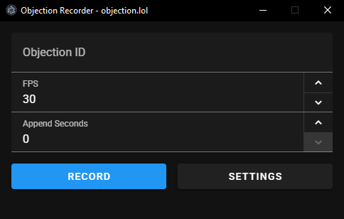

**CONTENTS**

1. [Introduction](#objectionlol-recorder)
2. [Installation](#installation)
   1. [Windows](#windows)
   2. [Linux](#linux)
      1. [Debian / Ubuntu / Linux Mint](#debian--ubuntu--linux-mint)
      2. [Fedora](#fedora)
      3. [Arch Linux / Manjaro](#arch-linux--manjaro)
      4. [openSUSE (Tumbleweed and Leap)](#opensuse-tumbleweed-and-leap)
      5. [Gentoo](#gentoo)
3. [Development](#development)
4. [Contributing](#contributing)
5. [License](#license)
6. [Acknowledgements](#acknowledgments)

# Objection.lol Recorder

A desktop application for recording videos from [objection.lol](https://objection.lol). This tool allows you to create recordings of your scene projects.



## Features

- Adjustable volume settings for master, music, sound effects, and blips
- Customizable framerates (up to 60 FPS)
- Append additional seconds to the end of recordings

## Installation

### Windows

1. Download the latest release from the [Releases](https://github.com/objection-lol/objection-lol-recorder/releases) page
2. Extract the ZIP file
3. Run the installer, it will automatically install the recorder and add a shortcut to your desktop.

The application includes its own bundled version of FFmpeg, so no additional installation is required for basic video recording.

### Audio Recording Setup

On Windows, to record with audio you'll need to install the virtual audio capturer:

1. Download and install [screen-capture-recorder](https://github.com/rdp/screen-capture-recorder-to-video-windows-free/releases)

On Linux, make sure to either have pulseaudio or pipewire-pulseaudio installed.

### Linux

**If you have a Distribution with AppArmor (such as Linux Mint or Ubuntu)**, then you need to launch the recorder with --no-sandbox arguments.
[You can create a .desktop file for convenience](https://wiki.archlinux.org/title/Desktop_entries#File_example)


On Linux, the program is provided as an AppImage. While this executable is distro-agnostic, it currently
still requires you to install ffmpeg, and gstreamer with it's relevant codecs and plugins. You can contribute by
packaging these tools in the AppImage.

Verify installation:

```bash
ffmpeg -version
gst-launch-1.0 --version
```

---

#### Debian / Ubuntu / Linux Mint

```bash
sudo apt update
sudo apt install -y ffmpeg \
  gstreamer1.0-tools \
  gstreamer1.0-plugins-base \
  gstreamer1.0-plugins-good \
  gstreamer1.0-plugins-bad \
  gstreamer1.0-plugins-ugly \
  gstreamer1.0-libav
```

If you are on Linux Mint or otherwise using Xorg server, you also need to install xdotool
```bash
sudo apt install -y xdotool
```

#### Fedora

```bash
sudo dnf install -y ffmpeg ffmpeg-libs \
  gstreamer1 \
  gstreamer1-plugins-base \
  gstreamer1-plugins-good \
  gstreamer1-plugins-bad-free \
  gstreamer1-plugins-bad-freeworld \
  gstreamer1-plugins-ugly \
  gstreamer1-libav
```

> Note: `rpmfusion` repository is required for some of the plugins:

```bash
sudo dnf install https://mirrors.rpmfusion.org/free/fedora/rpmfusion-free-release-$(rpm -E %fedora).noarch.rpm https://mirrors.rpmfusion.org/nonfree/fedora/rpmfusion-nonfree-release-$(rpm -E %fedora).noarch.rpm && sudo dnf swap ffmpeg-free ffmpeg --allowerasing
```

#### Arch Linux / Manjaro

```bash
sudo pacman -Sy --noconfirm ffmpeg \
  gstreamer \
  gst-plugins-base \
  gst-plugins-good \
  gst-plugins-bad \
  gst-plugins-ugly \
  gst-libav
```

#### openSUSE (Tumbleweed and Leap)

```bash
sudo zypper refresh
sudo zypper install -y ffmpeg-5 \
  gstreamer \
  gstreamer-plugins-base \
  gstreamer-plugins-good \
  gstreamer-plugins-bad \
  gstreamer-plugins-ugly \
  gstreamer-libav
```

> For proprietary codecs, add Packman repo:

```bash
sudo zypper ar -cfp 90 https://ftp.gwdg.de/pub/linux/misc/packman/suse/openSUSE_Tumbleweed/ packman
sudo zypper dup --from packman --allow-vendor-change
```

#### Gentoo

Add the required USE flags in `/etc/portage/package.use`:

```bash
echo "media-video/ffmpeg X aac alsa encode mp3 theora threads vorbis x264 x265" >> /etc/portage/package.use/ffmpeg
```

```bash
emerge --ask media-video/ffmpeg
emerge --ask media-libs/gstreamer \
  media-plugins/gst-plugins-base \
  media-plugins/gst-plugins-good \
  media-plugins/gst-plugins-bad \
  media-plugins/gst-plugins-ugly \
  media-plugins/gst-plugins-libav
```

## Usage

1. Enter an Objection ID (either the full URL like `https://objection.lol/objection/1` or just the ID number)
2. Adjust FPS settings as desired
3. Set any additional seconds to append to the recording
4. To avoid background audio being recorded, turn off any background music or sounds
5. Click "Record" and choose where to save the output file
6. Wait for the scene to play and recording to complete, you can ALT-TAB away while it records
7. You can cancel the process by clicking "Stop Recording" if you want to

## Settings

Access the settings menu to configure:

- Volume levels

## Development

### Prerequisites

- Node.js and npm

### Setup Development Environment

```bash
# Clone the repository
git clone https://github.com/objection-lol/objection-lol-recorder.git

# Navigate to project directory
cd objection-lol-recorder

# Install dependencies
npm install

# Start development mode
npm run dev
```

### Building

```bash
# Package the application
npm run package
```

## Platform Support

- Windows: Fully supported
- Linux: Fully supported
- MacOS: Currently unsupported, but contributions to add support are welcome.

## Contributing

Contributions are welcome! Here are some ways you can contribute:

1. Implement macOS or improve Linux support
2. Add new features or improve existing ones
3. Fix bugs
4. Improve documentation

Please follow these steps to contribute:

1. Fork the repository
2. Create a feature branch (`git checkout -b feature/amazing-feature`)
3. Commit your changes (`git commit -m 'Add some amazing feature'`)
4. Push to the branch (`git push origin feature/amazing-feature`)
5. Open a Pull Request

## License

This project is licensed under the MIT License

## Acknowledgments

- [FFmpeg](https://ffmpeg.org/) for video processing capabilities
- [Electron](https://www.electronjs.org/) for the application framework
- [screen-capture-recorder](https://github.com/rdp/screen-capture-recorder-to-video-windows-free) for audio capture functionality
